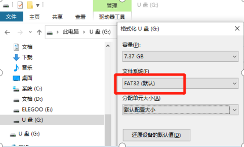
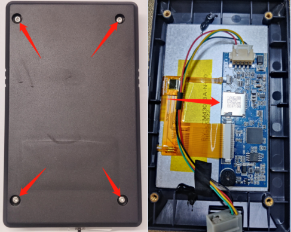
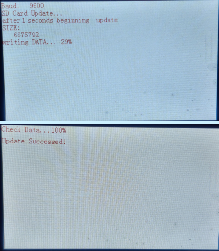
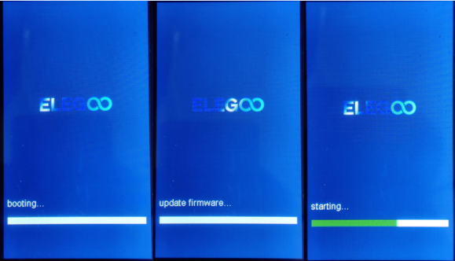
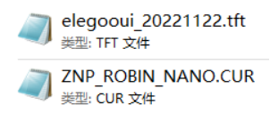
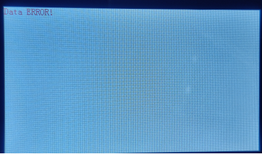
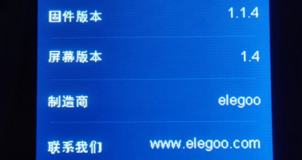
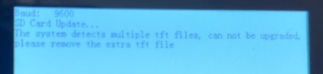
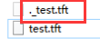
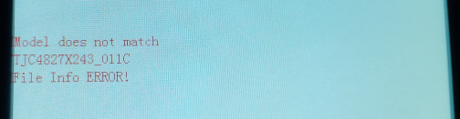

- 温馨提醒: 本页面正在不断更新中，信息可能有残缺或不准确的地方。请持续关注，谢谢！ 

---
# **_Neptune3Pro/Plus/Max固件更新说明_**

### 固件版本兼容性：    
| 屏幕版本      |      主板版本            |
|------------|-------------------------------------|
| 1.4       |      1.x.4 - 1.x.5.1          |
| 1.5-Beta  |      1.x.5.2 - 1.x.5.3           |
    
[更新日志](https://gitee.com/feng-zirong/neptune_3_pro/blob/master/Update%20log.md)

---    
### 文件描述： 

| 固件命名方式|            |
|------------|-------------------------------------|
| xxxxxxxx.tft       |      屏幕固件          |
| ZNP_ROBIN_NANO.bin |      主板固件           |

   

---    
### 准备步骤：    
1.  如图所示，格式化TF卡。      
    要求：文件系统（F）: FAT32      
      

2.  如图所示，将以上两个固件文件拷贝到TF卡根目录下。    

---  
### 屏幕固件更新步骤：    
1. 松开螺丝，拆下屏幕后盖；注意插卡方向，插入TF卡 。      
  

2. 重启电源，等待加载固件完成即可。固件加载过程以及完成的界面显示如图所示，加载完成后移除TF卡重启机器即可。（屏幕固件更新需要时间：大约60秒）  

---  
### 主板固件更新步骤：    
将TF卡插入机器，然后重启电源，等待固件加载完成即可；固件加载过程中的屏幕显示如所示，固件更新完成后会直接进入主界面。（主板固件更新时间：大约15秒。如果长时间无法进入主界面，则格式化TF卡重新加载固件即可。）  

---  
# **_`FAQ：`_** 
1、屏幕固件和主板固件的兼容性关系？ 
Neptune3Pro/Plus/Max机器的屏幕固件是通用的，主板固件也是使用的同一个源码。主板固件命名方式：    
Neptune3Pro：1.1.x.x    
Neptune3Plus:1.2.x.x   
Neptune3Max:1.3.x.x    
不同版本的屏幕固件以及主板固件之间的兼容性关系和更新内容请查看 [更新日志](https://gitee.com/feng-zirong/neptune_3_pro/blob/master/Update%20log.md) 。

2、启动电源后一直显示界面“Update firmware...”，如图所示。    
    
原因：启动电源一段时间后，如果显示屏没接收到主板发出的信号，就会跳转到该界面，直到接收到主板信号后才会启动。    
根本原因和解决方法：    
①这是1.1.5.2版本之前的固件常见问题，建议检查更新固件。    
②主板与显示屏之间的连接线接触不良（信号线接触不良），建议将连接线插紧点之后再重启。    
    
3、屏幕固件加载后不会重命名，可以重复加载，所以更新屏幕固件后必须移除TF卡；主板固件成功加载后会重命名为“ZNP_ROBIN_NANO.CUR”，可将后缀重命名后再次进行加载。  

4、如果没有等到屏幕固件加载完成就断开电源或移除TF卡，重启电源后将不能正常进入操作主界面，显示如下：  

5、可以在【设置】→【信息】中查看UI版本和主板固件版本。  

6、重新加载主板固件后，调平值将清零，需要重新调平。  

7、屏幕掉电恢复后会导致一些信息丢失（如固件版本号丢失、打印中的缩略图不显示），属于正常现象，不会影响正常打印，重启机器即可显示。    

8、如图，升级屏幕固件时显示‘多个TFT文件’后直接进入主界面。    
    
原因：部分macOS系统的MacBook，在拷贝固件或其它文件的时候会产生“”前缀的同名文件，在MacBook上没法查看，但是其它系统可以查看，这是导致更新屏幕固件失败的主要原因。如图所示：    
     
MacBook拷贝时出现“”前缀的同名文件的解决方法：①将需要的文件移动至U盘。②打开“终端”。 ③输入dot_clean后面加一个空格，再将U盘图标拉拖入终端界面。④按下按键Enter后将U盘退出即可将“”前缀的同名文件删除。     
解决方法如视频所示操作即可： [video-1](https://youtu.be/mdb4PTPlJh4)   
   

9、升级屏幕固件时显示图中错误。    
   
原因：屏幕固件文件损坏。     
解决方法：    
    ①格式化TF卡    
    ②重新下载文件或联系售后人员获取屏幕固件文件重新更新固件    
    ③尝试使用问题6中的处理方法进行处理    

